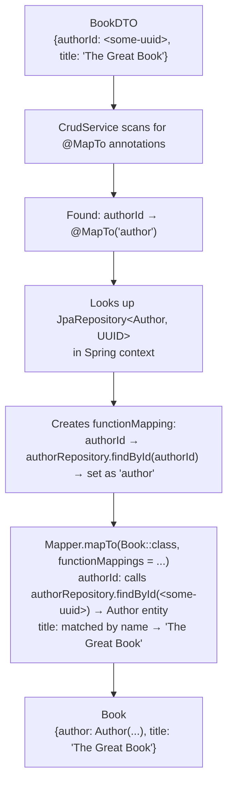
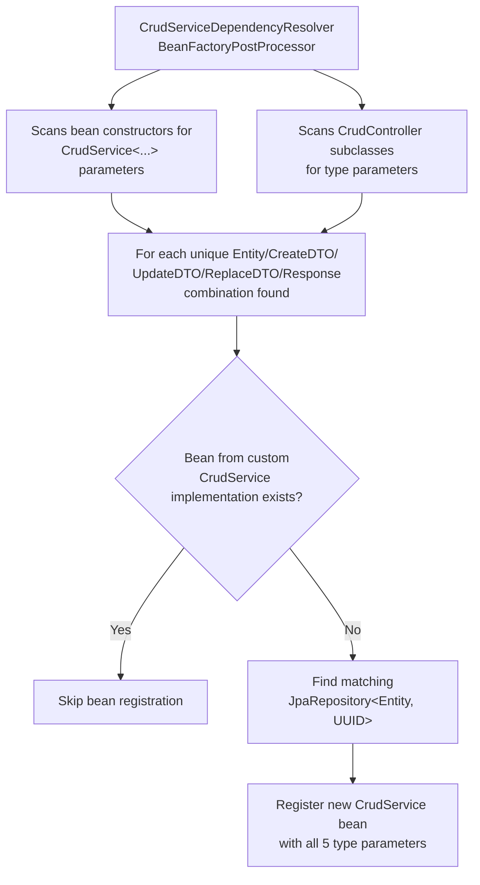
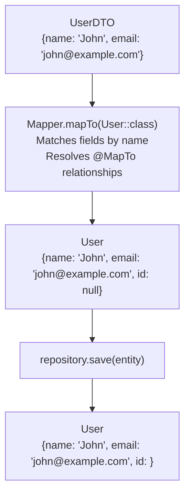
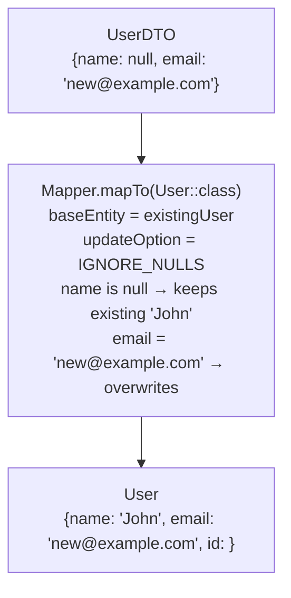
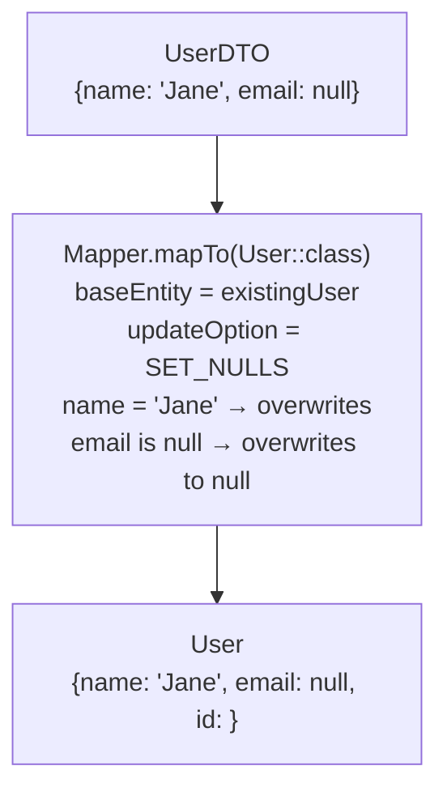
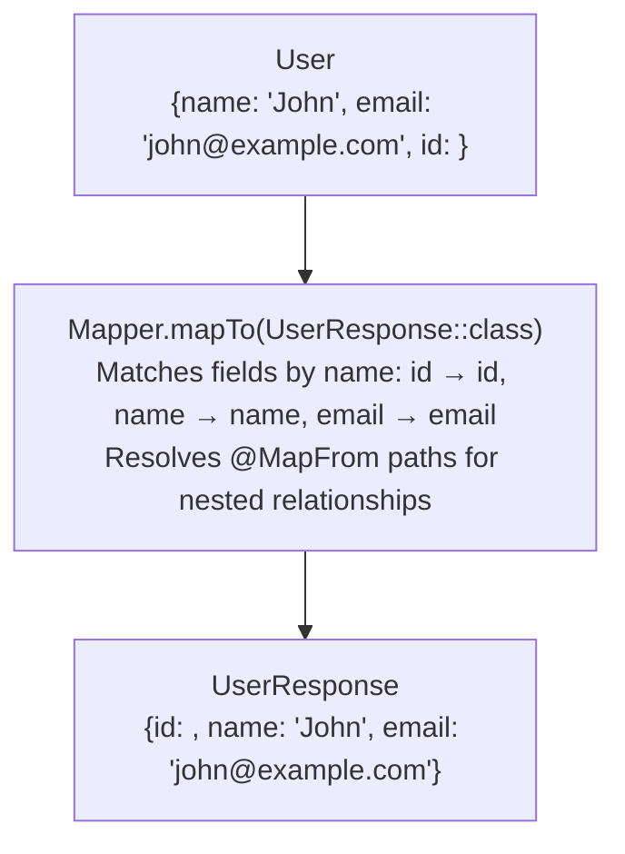

# Service Spring Boot Starter

> **RENAMED**: This library has been renamed to:
>
> - [`service-spring-boot-starter`](https://github.com/phorus-group/service-spring-boot-starter)
>
> This library will not receive further updates. Please migrate to the replacement above.

[](https://www.apache.org/licenses/LICENSE-2.0)
[](https://mvnrepository.com/artifact/group.phorus/service-spring-boot-starter)
[](https://codecov.io/gh/phorus-group/service-spring-boot-starter)

Common utilities library for Spring Boot WebFlux services. Provides transaction management for lazy-loaded
JPA relationships in reactive contexts, DTO-entity mapping with `@MapTo`/`@MapFrom` annotations, validation
groups for CRUD operations, and generic `CrudService`/`CrudController` base classes that handle standard
REST operations. Designed to reduce boilerplate in service layer implementations.

### Notes

> The project runs a vulnerability analysis pipeline regularly,
> any found vulnerabilities will be fixed as soon as possible.

> The project dependencies are being regularly updated by [Renovate](https://github.com/phorus-group/renovate).

> The project has been thoroughly tested to ensure that it is safe to use in a production environment.

## Table of contents

- [Getting started](#getting-started)
  - [Installation](#installation)
  - [Quick start](#quick-start)
- [Features](#features)
- [BaseEntity](#baseentity)
  - [AuditableEntity](#auditableentity)
- [CrudService](#crudservice)
  - [Separate DTOs per operation](#separate-dtos-per-operation)
  - [Extending CrudService](#extending-crudservice)
  - [Overriding individual methods](#overriding-individual-methods)
- [CrudController](#crudcontroller)
  - [Entity-to-response mapping](#entity-to-response-mapping)
  - [Adding custom endpoints](#adding-custom-endpoints)
- [Validation groups](#validation-groups)
- [Relationship mapping with @MapTo](#relationship-mapping-with-mapto)
  - [Bidirectional mapping](#bidirectional-mapping)
  - [How @MapTo works with Mapper](#how-mapto-works-with-mapper)
  - [Understanding @MapFrom path navigation](#understanding-mapfrom-path-navigation)
  - [Multiple relationships](#multiple-relationships)
  - [Using ID-only references (no JPA relationships)](#using-id-only-references-no-jpa-relationships)
- [Transaction management and lazy loading](#transaction-management-and-lazy-loading)
  - [How CrudService solves this](#how-crudservice-solves-this)
  - [Transaction helpers for custom logic](#transaction-helpers-for-custom-logic)
  - [Why CrudService return DTOs, not entities](#why-crudservice-return-dtos-not-entities)
  - [Transactional mapping extensions](#transactional-mapping-extensions)
  - [Blocking I/O and Dispatchers.IO](#blocking-io-and-dispatchersio)
  - [Entities and coroutine context switches](#entities-and-coroutine-context-switches)
- [Optimizing queries to avoid N+1 selects](#optimizing-queries-to-avoid-n1-selects)
- [Default configuration](#default-configuration)
  - [PostProcessorConfig](#postprocessorconfig)
  - [WebFluxConfig](#webfluxconfig)
- [How it works under the hood](#how-it-works-under-the-hood)
  - [Why abstracting CRUD operations?](#why-abstracting-crud-operations)
  - [Requirements](#requirements)
  - [How the automatic bean registration works](#how-the-automatic-bean-registration-works)
  - [The role of Phorus Mapper](#the-role-of-phorus-mapper)
- [Building and contributing](#building-and-contributing)
- [Authors and acknowledgment](#authors-and-acknowledgment)

***

## Getting started

### Installation

Make sure that `mavenCentral` (or any of its mirrors) is added to the repository list of the project.

Binaries and dependency information for Maven and Gradle can be found at [http://search.maven.org](https://search.maven.org/search?q=g:group.phorus%20AND%20a:service-spring-boot-starter).

<details open>
<summary>Gradle / Kotlin DSL</summary>

```kotlin
implementation("group.phorus:service-spring-boot-starter:x.y.z")
```
</details>

<details open>
<summary>Maven</summary>

```xml
<dependency>
  <groupId>group.phorus</groupId>
  <artifactId>service-spring-boot-starter</artifactId>
  <version>x.y.z</version>
</dependency>
```
</details>

This library depends on:
- [Phorus Mapper](https://github.com/phorus-group/mapper), reflection-based object mapping (DTO ↔ entity ↔ response conversions)
- [exception-spring-boot-starter](https://github.com/phorus-group/exception-spring-boot-starter), standardized error responses (`NotFound`, `BadRequest`, etc.), and automatic exception handling

Both are included automatically when you add `service-spring-boot-starter` to your project. You can use their
classes and functions directly without declaring them as separate dependencies.

### Quick start

**1. Define an entity extending `BaseEntity`:**

```kotlin
@Entity
@Table(name = "users")
class User(
  @Column(nullable = false)
  var name: String? = null,

  @Column(nullable = false)
  var email: String? = null,
) : BaseEntity()
```

**2. Define a DTO with validation groups:**

```kotlin
data class UserDTO(
  @field:NotBlank(groups = [Create::class], message = "Cannot be blank")
  var name: String? = null,

  @field:NotBlank(groups = [Create::class], message = "Cannot be blank")
  @field:Email(groups = [Create::class, Update::class], message = "Invalid email format")
  var email: String? = null,
)
```

**3. Define a response class:**

Mapper maps entity fields to response fields by matching names. Fields like `id`, `name`, `email`
are mapped automatically because they have the same names on both the entity and response:

```kotlin
data class UserResponse(
  var id: UUID? = null,
  var name: String? = null,
  var email: String? = null,
)
```

**4. Define a JPA repository:**

```kotlin
interface UserRepository : JpaRepository<User, UUID>
```

**5. Create a controller:**

```kotlin
@RestController
@RequestMapping("/user")
class UserController : SimpleCrudController<User, UserDTO, UserResponse>()
```

This setup provides the following endpoints:

| Method | Path | Description |
|--------|------|-------------|
| `GET` | `/user/{id}` | Find user by ID → Mapper converts `User` entity to `UserResponse` |
| `POST` | `/user` | Mapper converts `UserDTO` → `User` entity, saves, returns `201 Created` with `Location` header |
| `PATCH` | `/user/{id}` | Partial update: merges `UserDTO` onto existing `User` with `IGNORE_NULLS` (null fields ignored), returns `204 No Content` |
| `PUT` | `/user/{id}` | Full replacement: applies all `UserDTO` fields to `User` including nulls, returns `204 No Content` |
| `DELETE` | `/user/{id}` | Finds and deletes user, returns `204 No Content` |

`SimpleCrudController` and `SimpleCrudService` are typealiases that reuse the same DTO for all
operations. When you need separate DTOs per operation, use `CrudController` and `CrudService` directly
(see [Separate DTOs per operation](#separate-dtos-per-operation)).

The controllers use a `CrudService` bean internally, which is resolved **automatically**; the library
detects the controller's type parameters, finds the matching `JpaRepository<User, UUID>`, and
registers a `CrudService` bean at startup. This will also happen if you decide to use the CrudService directly.
No service class needs to be created. See [How the automatic bean registration works](#how-the-automatic-bean-registration-works) for details.

You can also extend the service or controller classes, or use only the parts of the library you need.

***

## Features

<details>
<summary><b>CRUD abstractions</b></summary>

- **Generic CRUD service**: provides `findById`, `create`, `update`, `replace`, and `delete`. You define your entity, DTO, and response types; the library handles the rest.
- **Generic CRUD controller**: exposes `GET /{id}`, `POST`, `PATCH /{id}`, `PUT /{id}`, `DELETE /{id}` REST endpoints from a single class definition.
- **Automatic bean resolution**: the library detects which `CrudService` beans your controllers and services need, finds the matching `JpaRepository`, and registers them at startup. You don't need to write a service class for basic CRUD.
- **DTO ↔ entity mapping**: powered by [Phorus Mapper](https://github.com/phorus-group/mapper). When a request comes in, the library converts the incoming DTO to a JPA entity for persistence. When a response goes out, it converts the entity back to a response DTO. You never write this conversion code yourself.
- **Relationship mapping**: DTOs use flat UUID fields (e.g. `authorId: UUID`) while entities use JPA relationships (e.g. `author: Author`). The `@MapTo` annotation tells the library how to resolve the UUID to a full entity on writes, and `@MapFrom` tells it how to extract the UUID back on reads.
- **Partial and full updates**: `PATCH` endpoints ignore null fields in the DTO, so you can update individual fields without sending the entire object. `PUT` endpoints treat null fields as intentional, overwriting existing values.
- **Validation groups**: apply different validation rules depending on the operation. For example, require a `name` field on `POST` and `PUT`, but make it optional on `PATCH`.

</details>

<details>
<summary><b>Common configurations</b></summary>

- **Graceful shutdown**: the server waits for active requests to complete before shutting down, preventing interrupted responses.
- **Non-null JSON responses**: null fields are omitted from JSON output, keeping API responses clean.
- **Pageable support**: registers `ReactivePageableHandlerMethodArgumentResolver` so you can use `@PageableDefault` and `Pageable` parameters in your WebFlux controllers.
- **WebFlux bridge method filtering**: when a controller extends a generic base class, the Kotlin compiler generates bridge methods that would cause duplicate endpoint registration errors. The library filters these out automatically.

</details>

<details>
<summary><b>Integration</b></summary>

- **Error handling** via [exception-spring-boot-starter](https://github.com/phorus-group/exception-spring-boot-starter): when an entity is not found, the library throws `NotFound`, which is automatically converted to a structured `404` JSON response.
- **Object mapping** via [Phorus Mapper](https://github.com/phorus-group/mapper): all DTO/entity/response conversions are handled by Mapper's reflection-based field matching. Fields with the same name are mapped automatically.

</details>

***

## BaseEntity

All entities must extend `BaseEntity`, which provides a UUID primary key:

```kotlin
@MappedSuperclass
abstract class BaseEntity(
  @Id
  @GeneratedValue(strategy = GenerationType.UUID)
  var id: UUID? = null,
) : Serializable
```

The `id` field is auto-generated on insert and serves as the primary key for all CRUD operations.

<details>
<summary><b>Note on <code>var</code> fields</b></summary>

The Jakarta Persistence specification requires all entity fields to be non-final.
Kotlin `val` compiles to `final` fields in Java, which violates the JPA specification. While some JPA providers
can modify `final` fields via reflection, it's not compliant and future Java versions may restrict this. This
is why entity fields use `var` with default `null` values.

</details>

### AuditableEntity

For entities that need automatic audit timestamps, extend `AuditableEntity` instead of `BaseEntity`:

```kotlin
@MappedSuperclass
abstract class AuditableEntity(
    @Column(nullable = false, updatable = false)
    @CreationTimestamp
    var createdAt: Instant = Instant.now(),

    @Column(nullable = false)
    @UpdateTimestamp
    var updatedAt: Instant = Instant.now(),
) : BaseEntity()
```

This provides:
- `createdAt`: set once on insert, immutable, UTC via `Instant`
- `updatedAt`: auto-updated on every modification, UTC via `Instant`
- All features from `BaseEntity` (UUID `id`)

**Example:**
```kotlin
@Entity
@Table(name = "products")
class Product(
    @Column(nullable = false)
    var name: String? = null,
    
    @Column(nullable = false)
    var price: BigDecimal? = null,
) : AuditableEntity()  // Includes id, createdAt, updatedAt
```

## CrudService

As described in [How the automatic bean registration works](#how-the-automatic-bean-registration-works),
`CrudService` instances are created automatically when needed. Each unique type combination receives
its own bean, so the same entity can have multiple `CrudService` instances with different DTOs or
response types:

```kotlin
class SomeService(
    private val fullCrud: SimpleCrudService<User, UserDTO, UserResponse>,           // one bean
    private val detailCrud: SimpleCrudService<User, UserDTO, UserDetailResponse>,   // another bean
)
```

### Separate DTOs per operation

`CrudService` supports (optionally) to set different DTO types for create, update, and replace operations. In cases
were a single DTO for the operations is enough, the typealias `SimpleCrudService` can be used instead.

This also applies to the `CrudController` and `SimpleCrudController`.

**Single DTO for all operations:**

```kotlin
// Service
abstract class UserService : SimpleCrudService<User, UserDTO, UserResponse>()

// Controller
@RestController
@RequestMapping("/user")
class UserController : SimpleCrudController<User, UserDTO, UserResponse>()
```

**Different DTOs per operation:**

```kotlin
// DTOs with different fields
data class CreateUserDTO(
    @field:NotBlank(groups = [Create::class])
    var name: String? = null,
    
    @field:NotBlank(groups = [Create::class])
    var password: String? = null,  // Only in create
)

data class UpdateUserDTO(
    var name: String? = null,  // No password field
)

// Service
abstract class UserService : CrudService<User, CreateUserDTO, UpdateUserDTO, UpdateUserDTO, UserResponse>()

// Controller
@RestController
@RequestMapping("/user")
class UserController : CrudController<User, CreateUserDTO, UpdateUserDTO, UpdateUserDTO, UserResponse>()
```

### Extending CrudService

When you need custom business logic beyond basic CRUD (authorization checks, extra queries,
integrations), extend `CrudService`. The standard CRUD methods are inherited, so you only
implement what's different.

The recommended pattern is to define an abstract service with your custom method signatures,
then implement it in a concrete class:

```kotlin
// Abstract service declares custom methods
abstract class EmployeeService : SimpleCrudService<Employee, EmployeeDTO, EmployeeResponse>() {
    abstract suspend fun findAllByDepartmentId(departmentId: UUID, pageable: Pageable): Page<Employee>
    abstract suspend fun resetPassword(employeeId: UUID, request: ResetPasswordRequest)
}

// Implementation only injects what the custom logic needs
@Service
class EmployeeServiceImpl(
    private val employeeRepository: EmployeeRepository,
) : EmployeeService() {

    override suspend fun findAllByDepartmentId(departmentId: UUID, pageable: Pageable) =
        withContext(Dispatchers.IO) { employeeRepository.findAllByDepartmentId(departmentId, pageable) }

    override suspend fun resetPassword(employeeId: UUID, request: ResetPasswordRequest) {
        // custom logic...
    }
}
```

When the library sees that a `SimpleCrudService<Employee, EmployeeDTO, EmployeeResponse>` subclass
already exists as a bean, it skips creating a generic one. Your implementation inherits `findById`,
`create`, `update`, `replace`, and `delete` from `CrudService`, you only need to write the methods
that are specific to your domain.

### Overriding individual methods

Any `CrudService` method can be overridden to add authorization checks, custom validation, or
extra logic while still delegating to the base implementation with `super`:

```kotlin
@Service
class OrderServiceImpl(
    private val orderRepository: OrderRepository,
    private val customerService: CustomerService,
) : OrderService() {

    override suspend fun create(dto: OrderDTO): UUID {
        val customer = customerService.findById(dto.customerId!!)
        val userId = AuthContext.context.get().userId

        if (userId != customer.accountManagerId) {
            throw Forbidden("User $userId is not allowed to create orders for this customer.")
        }

        return super.create(dto)
    }

    override suspend fun delete(id: UUID) {
        val order = withContext(Dispatchers.IO) {
            withReadTransaction {
                orderRepository.findById(id)
                    .orElseThrow { NotFound("Order with id $id not found.") }
            }
        }
        val userId = AuthContext.context.get().userId

        val customerAccountManagerId = withContext(Dispatchers.IO) { order.customer?.accountManagerId }
        if (userId != customerAccountManagerId && userId != order.createdBy) {
            throw Forbidden("User $userId is not allowed to delete this order.")
        }

        super.delete(id)
    }
}
```

<details>
<summary><b>Example: using Mapper's <code>functionMappings</code> directly in <code>create</code></b></summary>

The `create` method can also be overridden to, for example, use Mapper directly with custom `functionMappings`
when special field transformations are required:

```kotlin
// Hashes the password during creation using Mapper's functionMappings
override suspend fun create(dto: EmployeeDTO): UUID {
    val exists = withContext(Dispatchers.IO) { employeeRepository.existsByEmail(dto.email!!) }
    if (exists) throw Conflict("Employee with email ${dto.email} already exists")

    // Mapper's functionMappings: transform "password" → hash it → store as "passwordHash"
    val entity = dto.mapTo<Employee>(functionMappings = mapOf(
        EmployeeDTO::password to ({ password: String -> encoder.encode(password) }
            to (Employee::passwordHash to MappingFallback.NULL))
    ))!!

    return withContext(Dispatchers.IO) { employeeRepository.save(entity) }.id!!
}
```

For more on `functionMappings`, see the
[Phorus Mapper README](https://github.com/phorus-group/mapper).

</details>

## CrudController

`CrudController` provides five standard REST endpoints. Extend it, specify your types, and
you have a working API:

```kotlin
@RestController
@RequestMapping("/product")
class ProductController : SimpleCrudController<Product, ProductDTO, ProductResponse>()
```

The base path for the `Location` header on `POST` responses is extracted from `@RequestMapping`,
and the matching `CrudService` bean is auto-discovered from the Spring context.

### Entity-to-response mapping

Entity-to-response conversion happens inside `CrudService.findById`, not in the controller.
The service loads the entity and maps it to the response type inside a read-only transaction
(see [Transaction management and lazy loading](#transaction-management-and-lazy-loading) for why
this matters). The controller simply delegates:

```kotlin
open suspend fun findById(@PathVariable id: UUID): RESPONSE =
    service.findById(id)
```

Mapper's `@MapFrom` annotation controls how nested entity fields are extracted into flat response
fields. See [Relationship mapping with @MapTo](#relationship-mapping-with-mapto) for details.

### Adding custom endpoints

All controller methods are `open`, so you can override existing endpoints or add new ones
alongside the inherited CRUD operations.

**Overriding an endpoint** to add custom behavior (e.g., custom validation or response headers):

```kotlin
@RestController
@RequestMapping("/product")
class ProductController(
    private val productService: ProductService,
) : SimpleCrudController<Product, ProductDTO, ProductResponse>() {

    // Override create
    @PostMapping
    override suspend fun create(
        @Validated(Create::class) @RequestBody dto: ProductDTO,
    ): ResponseEntity<Void> {
        if (productService.existsBySku(dto.sku!!)) {
            throw Conflict("Product with SKU ${dto.sku} already exists")
        }
        
        val productId = productService.create(dto)
        return ResponseEntity.created(URI.create("/product/$productId"))
            .header("X-Custom-Header", "ProductCreated")
            .build()
    }

    // Custom endpoint alongside inherited CRUD
    @GetMapping("/search")
    suspend fun searchProducts(
        @RequestParam query: String,
        @ParameterObject @PageableDefault pageable: Pageable,
    ): Page<ProductResponse> =
        productService.searchByName(query, pageable).let { page ->
            PageImpl(page.mapTo<List<ProductResponse>>()!!, pageable, page.totalElements)
        }
}
```

**Adding a paginated query** endpoint alongside the inherited CRUD ones:

```kotlin
@RestController
@RequestMapping("/book")
class BookController(
    private val bookService: BookService,
) : SimpleCrudController<Book, BookDTO, BookResponse>() {

    @GetMapping("/findAllBy/authorId")
    @ResponseStatus(HttpStatus.OK)
    suspend fun findAllByAuthorId(
        @RequestParam authorId: UUID,
        @ParameterObject @PageableDefault pageable: Pageable,
    ): Page<BookResponse> =
        bookService.findAllByAuthorId(authorId, pageable).let { page ->
            PageImpl(page.mapTo<List<BookResponse>>()!!, pageable, page.totalElements)
        }
}
```

The `@PageableDefault` annotation works because [WebFluxConfig](#webfluxconfig) registers
`ReactivePageableHandlerMethodArgumentResolver` automatically.

## Validation groups

Different operations often need different validation rules. When creating an entity, you want
all required fields to be present. But on a partial update (`PATCH`), you only want to validate
the fields that were actually sent, since missing fields are intentionally left unchanged.

The library provides three marker interfaces for this:

```kotlin
interface Create   // applied on POST
interface Update   // applied on PATCH
interface Replace  // applied on PUT
```

Use them with Jakarta validation's `groups` parameter to control which rules apply to which
operation. `CrudController` applies the correct group automatically:
- `POST` requests validate with `@Validated(Create::class)`
- `PATCH` requests validate with `@Validated(Update::class)`
- `PUT` requests validate with `@Validated(Replace::class)`

```kotlin
data class UserDTO(
    @field:NotBlank(groups = [Create::class, Replace::class], message = "Cannot be blank")
    var name: String? = null,

    @field:NotBlank(groups = [Create::class, Replace::class], message = "Cannot be blank")
    @field:Email(groups = [Create::class, Update::class, Replace::class], message = "Invalid email format")
    var email: String? = null,

    @field:NotBlank(groups = [Create::class, Replace::class], message = "Cannot be blank")
    var password: String? = null,
)
```

In this example:
- On **POST** (Create): `name`, `email`, and `password` are all required
- On **PATCH** (Update): only `email` is validated if provided. `name` and `password` can be omitted because Mapper's `IGNORE_NULLS` keeps existing values.
- On **PUT** (Replace): `name`, `email`, and `password` are all required. Same as Create because null values overwrite existing fields via `SET_NULLS`.

For validation error handling (structured `ApiError` responses with field-level details), see
[exception-spring-boot-starter](https://github.com/phorus-group/exception-spring-boot-starter).

## Relationship mapping with @MapTo

In most APIs, the client sends and receives flat JSON objects with UUID references to related
entities. For example, when creating a book, the client sends `{ "authorId": "<uuid>", "title": "..." }`.
But internally, the JPA entity can store this as a full object reference: `author: Author`.

This creates a mismatch: the DTO has a UUID, but the entity needs an actual `Author` object.
Something needs to look up that author from the database and set it on the entity. The same
problem exists in reverse: when returning a response, the entity has an `Author` object, but
the client expects a flat `authorId: UUID`.

The `@MapTo` and `@MapFrom` annotations solve both directions automatically.

### Bidirectional mapping

On write operations (POST, PATCH, PUT), `@MapTo` resolves UUID references to full entities.
When a DTO contains `authorId: UUID` annotated with `@MapTo("author")`, the library calls
`AuthorRepository.findById(authorId)` to load the actual `Author` entity and sets it on the
target entity's `author` field.

On read operations (GET), `@MapFrom` extracts nested entity IDs back to flat UUID fields. When
the response DTO has `authorId: UUID` annotated with `@MapFrom(["author/id"])`, Mapper navigates
from `entity.author.id` and populates the `response.authorId` field.

**Example, complete entity/DTO/response setup:**

```kotlin
// Entity with JPA relationship
@Entity
class Book(
    @ManyToOne
    var author: Author? = null,

    var title: String? = null,
) : BaseEntity()

// DTO with flat UUID field for writes (POST/PATCH/PUT)
data class BookDTO(
    @field:NotNull(groups = [Create::class], message = "Cannot be null")
    @MapTo("author")  // Resolves authorId → Author entity via AuthorRepository.findById
    var authorId: UUID? = null,

    @field:NotBlank(groups = [Create::class], message = "Cannot be blank")
    var title: String? = null,
)

// Response DTO with flat UUID field for reads (GET)
data class BookResponse(
    var id: UUID? = null,

    @MapFrom(["author/id"])  // Extracts book.author.id → authorId
    var authorId: UUID? = null,

    var title: String? = null,
)
```

If `findById` returns empty during writes, `CrudService` will throw `NotFound("Author with authorId <uuid> not found.")`.
On partial updates (PATCH), if the `authorId` field is `null` in the DTO, Mapper's fallback keeps the existing
relationship unchanged, so you can update other fields without touching the relationship.

### How @MapTo works with Mapper

<details>
<summary>Show details</summary>

`@MapTo` integrates with Mapper's `functionMappings` feature. The annotation has two parameters:
- `field`: the target entity field to populate (e.g., `"author"` maps to `entity.author`)
- `function`: the repository method to call to find such entity, defaults to `"findById"`

When `CrudService.create`, `CrudService.update`, or `CrudService.replace` is called, it:

1. Scans the DTO for fields annotated with `@MapTo`
2. For each annotated field, determines the target entity type from the `field` parameter
3. Finds the matching `JpaRepository` for that entity type in the Spring context
4. Creates a `functionMapping` that calls the repository method specified by the `function` parameter (default: `findById`)
5. Passes these mappings to Mapper, which calls them during the DTO → entity conversion

What happens at runtime:


</details>

### Understanding @MapFrom path navigation

<details>
<summary>Show details</summary>

The `@MapFrom` annotation uses path syntax to navigate entity object graphs. The `/` separator
tells Mapper to traverse relationships:

- `@MapFrom(["author/id"])` means "access the `author` field, then access its `id` field"
- `@MapFrom(["department/manager/name"])` would navigate `entity.department.manager.name`

This works for any nesting depth. Mapper handles null safety automatically; if any intermediate
field is null, the result is null.

This also works with lazy loaded relationships. The navigation happens inside `CrudService.findById`'s transaction
using the `transactionalMapTo` extension function, which wraps the mapping in a read-only transaction. This ensures
lazy loading uses the same Hibernate session without opening new database connections while mapping values.
See more in [Transaction management and lazy loading](#transaction-management-and-lazy-loading).

`@MapFrom` is part of Phorus Mapper, not this library. For advanced features like multiple source
paths, custom transformations, and collection mapping, see the
[Phorus Mapper README](https://github.com/phorus-group/mapper).

</details>

### Multiple relationships

DTOs can have multiple `@MapTo` fields for entities with several relationships.
Each is resolved independently via its respective repository:

```kotlin
// ProductDTO has two relationships
data class ProductDTO(
    @field:NotNull(groups = [Create::class], message = "Cannot be null")
    @MapTo("category")
    var categoryId: UUID? = null,

    @field:NotNull(groups = [Create::class], message = "Cannot be null")
    @MapTo("supplier")
    var supplierId: UUID? = null,

    @field:NotBlank(groups = [Create::class], message = "Cannot be blank")
    var name: String? = null,
)

data class ProductResponse(
    var id: UUID? = null,

    @MapFrom(["category/id"])
    var categoryId: UUID? = null,

    @MapFrom(["supplier/id"])
    var supplierId: UUID? = null,

    var name: String? = null,
)
```

### Using ID-only references (no JPA relationships)

The examples above use JPA relationship annotations (`@ManyToOne`, `@OneToMany`) to model
connections between entities, with `@MapTo` and `@MapFrom` bridging the gap between flat DTOs
and those object references. However, the library works just as well when entities store plain UUID foreign keys instead of
full object references.

In an ID-only approach, instead of declaring `@ManyToOne var author: Author? = null` on the
entity, you declare `@Column var authorId: UUID? = null`. Since the entity, DTO, and response
all share the same flat UUID type for the field, Mapper maps it by name automatically and neither
`@MapTo` nor `@MapFrom` is needed:

```kotlin
@Entity
class Book(
    @Column(nullable = false)
    var authorId: UUID? = null,

    @Column(nullable = false)
    var title: String? = null,
) : BaseEntity()

data class BookDTO(
    @field:NotNull(groups = [Create::class], message = "Cannot be null")
    var authorId: UUID? = null,

    @field:NotBlank(groups = [Create::class], message = "Cannot be blank")
    var title: String? = null,
)

data class BookResponse(
    var id: UUID? = null,
    var authorId: UUID? = null,
    var title: String? = null,
)
```

CrudService, CrudController, validation groups, and all other library features continue to work
the same way. No configuration changes are needed.

When you need data from a related entity, you call the corresponding service (which returns a
response DTO, following the convention of not passing entities between services) or write a
repository query with an explicit join. This is more manual than navigating a JPA relationship,
but it makes data access explicit and keeps entities simple.

<details>
<summary><b>Tradeoffs between JPA relationships and ID-only references</b></summary>

**JPA relationships** (`@ManyToOne`, `@OneToMany`, etc.) provide lazy loading so related data is
fetched only when accessed, cascading operations so that deleting a parent can automatically
delete its children, JPQL navigation like
`SELECT b FROM Book b WHERE b.author.name = :name`, and referential integrity checks at the
ORM level.

**ID-only references** (`@Column var authorId: UUID`) produce simpler entities with no proxy
objects or lazy initialization concerns, no bidirectional relationship complexity, no risk of
N+1 selects from accidental lazy loading during serialization, and entities that behave as
plain data objects. `@MapTo` and `@MapFrom` become unnecessary for those fields since the
entity, DTO, and response already share the same type. You would still use `@MapFrom` for
other cases where field extraction is needed (for example, a computed or nested
non-relationship field), but for foreign keys it adds no value when the entity stores the
ID directly. One catch is that a plain `@Column` UUID is just a regular column from JPA's
perspective, not a foreign key. Hibernate's auto-generated schema (`ddl-auto`) won't create
foreign key constraints for those fields, which means local test setups using Testcontainers
or H2 with auto-generated schemas will lack referential integrity enforcement on those
columns.

Both approaches are fully compatible with the library, and you can mix them in the same
project. JPA relationships work well for entities that are always loaded together (e.g., a
`User` with an `@OneToMany` collection of `Address` entities owned by the same service), while
ID-only references are a better fit when the related entity lives behind a different service
boundary or when you want to avoid the complexity that comes with Hibernate proxies, detached
entities, and session lifecycle management.

</details>

## Transaction management and lazy loading

<details>
<summary><b>What is lazy loading?</b></summary>

When a JPA entity has a relationship to another entity (e.g., a `Book` has an `Author`),
Hibernate does not always load the related entity from the database immediately. For
collections like `@OneToMany` and `@ManyToMany`, Hibernate defers loading until you actually
access the property. This is called **lazy loading**, and it exists to avoid loading the entire
object graph when you only need the root entity.

The catch is that lazy loading only works while the Hibernate **session** (the database
connection context) is still open. Once the session closes, any attempt to access a
lazy-loaded property will fail.

</details>

### How CrudService solves this

`CrudService` wraps all operations in explicit transactions via `TransactionTemplate`:

- **`findById`**: loads the entity **and** maps it to `RESPONSE` inside a single read-only
  transaction. `CrudController.findById` delegates to this directly, so all `GET /{id}` endpoints
  benefit automatically.
- **`create` / `update` / `replace` / `delete`**: run inside read-write transactions so that relationship
  resolution via `@MapTo` and entity saves happen atomically.

<details>
<summary><b>Why lazy loading normally fails during mapping</b></summary>

When Mapper converts an entity to a response DTO, it reads every property on the entity that
matches a field in the target DTO. If the DTO includes a field that maps from a lazy-loaded
relationship (either explicitly via `@MapFrom` or implicitly by matching property names), Mapper
will access that property on the entity.

The issue primarily affects **lazy-loaded collections** (`@OneToMany`, `@ManyToMany`). Mapper uses
reflection to access properties during conversion. Collections use `PersistentSet`/`PersistentBag`
wrappers that require an active Hibernate session to initialize.

If no other measures were taken, when Mapper encounters a lazy-loaded collection on a detached entity outside a transaction, the
session would be closed and the lazy loading would fail:

```
org.hibernate.LazyInitializationException:
  Cannot lazily initialize collection of role 'com.example.model.Author.books'
  - no session
```

A common workaround is setting `enable_lazy_load_no_trans: true` in Hibernate properties. This
tells Hibernate to open a **temporary database connection** for every lazy access outside a
transaction. While it works, it is wasteful (a new connection per lazy field) and bypasses
transaction boundaries. In our case, we prefer a different approach that we will mention below.

</details>

<details>
<summary><b>Which relationships are affected</b></summary>

| Annotation | Default fetch | Affected? | Mechanism |
|------------|--------------|-----------|-----------| 
| `@OneToMany` | `LAZY` | **Yes** | Hibernate wraps the collection in a `PersistentSet` / `PersistentBag` that requires an active session to initialize |
| `@ManyToMany` | `LAZY` | **Yes** | Same collection wrapper mechanism as `@OneToMany` |
| `@ManyToOne` | `EAGER` | Rarely | Loaded eagerly by default. If set to `fetch = LAZY`, Hibernate creates a proxy that fires a separate SELECT on access. In Hibernate these proxies can self-initialize without a session, but collection wrappers cannot. |
| `@OneToOne` | `EAGER` | Rarely | Same as `@ManyToOne` |

In practice, the issue surfaces when a response DTO maps from a `@OneToMany` or `@ManyToMany`
collection on the entity. For example:

```kotlin
// Entity with a lazy collection
@Entity
class User(
    @OneToMany(mappedBy = "user")  // LAZY by default
    var addresses: MutableSet<Address> = mutableSetOf(),
)

// Response DTO that triggers lazy loading via Mapper
data class UserDetailResponse(
    var id: UUID? = null,
    var name: String? = null,
    var addresses: List<AddressResponse>? = null,  // Mapper traverses user.addresses
)
```

When Mapper builds `UserDetailResponse`, it will access `user.addresses`. If the entity is detached
(no session), the `PersistentSet` will throw `LazyInitializationException`.

</details>

<details>
<summary><b>Lazy collection through a lazy proxy</b></summary>

When you traverse a lazy `@ManyToOne` proxy on a detached entity and then access a lazy collection
on the proxied entity (for example, `offer.submission.offers`), the proxy itself can self-initialize
but the collection on the resulting entity still requires an active session. This case fails the same
way as accessing a lazy collection directly on a detached entity, even when the load and the access
happen in the same thread:

```kotlin
// BAD: same thread, same withContext, but no surrounding transaction
suspend fun loadSiblingOffers(offerId: UUID): List<Offer> = withContext(Dispatchers.IO) {
    val offer = offerRepository.findById(offerId).orElseThrow { NotFound("...") }
    val submission = offer.submission         // lazy ManyToOne proxy, self-initializes
    submission?.offers?.toList()              // LazyInitializationException on the collection
        ?: emptyList()
}
```

The fix is the same as any other lazy collection access: wrap the read in
`withReadTransaction { }` / `transactionTemplate.execute`, or pre-fetch the collection with a
`JOIN FETCH` query so the lazy load never fires at runtime.

```kotlin
// GOOD: lazy collection access happens inside a transaction
suspend fun loadSiblingOffers(offerId: UUID): List<Offer> = withContext(Dispatchers.IO) {
    transactionTemplate.execute {
        val offer = offerRepository.findById(offerId).orElseThrow { NotFound("...") }
        offer.submission?.offers?.toList() ?: emptyList()
    }!!
}
```

</details>

### Transaction helpers for custom logic

When writing custom logic that accesses lazy relationships (as shown in
[Overriding individual methods](#overriding-individual-methods)), use the transaction helpers to
keep the Hibernate session open:

| Helper | Description |
|--------|-------------|
| `withTransaction { }` | Runs the block in a read-write transaction |
| `withReadTransaction { }` | Runs the block in a read-only transaction (no flushes, better for reads) |

Both are `protected` and available in `CrudService` subclasses. The session remains open for the
entire block, allowing safe traversal of lazy relationships.

### Why CrudService return DTOs, not entities

CrudService methods return response DTOs, not JPA entities. This is by design: entities contain
Hibernate proxies and lazy collections that will throw errors if accessed outside a transaction if
used with the Mapper directly. It also creates the risk of accessing a lazy collection that is not
initialized without using a `Dispatchers.IO` thread, which would block the main threads, as it
internally acts as a blocking operation.

Response DTOs are plain data objects that are safe to pass around anywhere.

In some cases, you may want to use the Mapper yourself. In that's the case, you can use the transactional
mapping extensions below to avoid all these issues.

### Transactional mapping extensions

The built-in CRUD methods already handle transactions for you. But when you write **custom
service methods** that load entities and convert them to response DTOs using the Mapper, you need to ensure
the conversion happens inside a transaction too. These service-layer extension functions handle that.

#### `fetchAndMapTo`

Loads an entity and maps it to a response DTO in a single read-only transaction:

```kotlin
@Service
class ProductServiceImpl(
    private val productRepository: ProductRepository,
    private val transactionTemplate: TransactionTemplate,
) : ProductService() {

    override suspend fun findDetailById(id: UUID): ProductDetailResponse =
        withContext(Dispatchers.IO) {
            transactionTemplate.fetchAndMapTo<ProductDetailResponse> {
                productRepository.findById(id).orElseThrow { NotFound("...") }
            }!!
        }
}

@GetMapping("/{id}/detail")
suspend fun findDetail(@PathVariable id: UUID): ProductDetailResponse =
    productService.findDetailById(id)
```

All optional parameters from [Phorus Mapper's](https://github.com/phorus-group/mapper) `mapTo` are supported:

```kotlin
transactionTemplate.fetchAndMapTo<ProductDetailResponse>(
    exclusions = listOf("internalField"),
    mappings = mapOf("sourceField" to ("targetField" to MappingFallback.NULL)),
    ignoreMapFromAnnotations = false,
    useSettersOnly = false,
    mapPrimitives = true,
) {
    productRepository.findById(id).orElseThrow { NotFound("...") }
}!!
```

When called inside an existing transaction, it joins it (no extra connection). When called
outside a transaction, it creates a new read-only transaction.

If you prefer to use Phorus Mapper's `mapTo` directly, you can wrap both the load and
the mapping call yourself inside a `TransactionTemplate` to achieve the same effect.

#### `transactionalMapTo` (reified)

Maps an already-loaded entity to a response type in a single read-only transaction:

```kotlin
@Service
class ProductServiceImpl(
    private val productRepository: ProductRepository,
    private val transactionTemplate: TransactionTemplate,
) : ProductService() {

    override suspend fun mapToResponse(product: Product): ProductResponse =
        withContext(Dispatchers.IO) {
            product.transactionalMapTo<ProductResponse>(transactionTemplate)!!
        }
}
```

All optional parameters from [Phorus Mapper's](https://github.com/phorus-group/mapper) `mapTo` are supported:

```kotlin
product.transactionalMapTo<ProductResponse>(
    transactionTemplate = transactionTemplate,
    exclusions = listOf("internalField"),
    mappings = mapOf("sourceField" to ("targetField" to MappingFallback.NULL)),
    ignoreMapFromAnnotations = false,
    useSettersOnly = false,
    mapPrimitives = true,
)!!
```

When called inside an existing transaction, it joins it (no extra connection). When called
outside a transaction, it creates a new read-only transaction for the mapping operation.

If you prefer, you can use Phorus Mapper's `mapTo` directly and wrap it inside a
`TransactionTemplate` yourself to achieve the same effect.

#### `transactionalMapTo` (KType)

Non-reified overload for runtime type resolution. Used internally by `CrudService.findById`.
Prefer the reified version or `fetchAndMapTo` in application code.

### Blocking I/O and Dispatchers.IO

WebFlux uses a small number of threads (called the event loop) to handle many requests
concurrently. These threads must never be blocked by slow operations like database queries.
If a thread blocks, it cannot handle other requests, and the server's throughput drops.

Hibernate and JPA repository calls are blocking by nature. In a `suspend` function, you must
wrap them in `withContext(Dispatchers.IO)` to move the blocking work off the event loop and
onto a thread pool designed for blocking I/O:

```kotlin
// CORRECT - blocking repository/lazy access wrapped in Dispatchers.IO
suspend fun findById(id: UUID): ProductResponse =
    withContext(Dispatchers.IO) {
        transactionTemplate.fetchAndMapTo<ProductResponse> {
            productRepository.findById(id).orElseThrow { NotFound("...") }
        }!!
    }

// WRONG - blocking call on the event loop thread
suspend fun findById(id: UUID): ProductResponse =
    transactionTemplate.fetchAndMapTo<ProductResponse> {
        productRepository.findById(id).orElseThrow { NotFound("...") }
    }!!
```

`CrudService` methods use `withContext(Dispatchers.IO)` internally. Custom service methods that
access repositories or lazy properties must do the same.

### Entities and coroutine context switches

Even with `withContext(Dispatchers.IO)` in place, passing a JPA entity out of that block and
accessing its lazy properties afterward will still throw `LazyInitializationException`. When
`withContext` returns, the Hibernate session that was open on that thread is gone. The object
remains in memory, but any lazy collection it holds can no longer be initialized.

```kotlin
// BAD: entity loaded inside withContext, lazy property accessed after the block returns
suspend fun submitOrder(id: UUID) {
    val order = withContext(Dispatchers.IO) {
        orderRepository.findById(id).orElseThrow { NotFound("...") }
    } // session is closed here, entity is now detached

    withContext(Dispatchers.IO) {
        // LazyInitializationException: no session on this thread
        order.items.forEach { processItem(it) }
    }
}
```

The same happens when an entity is passed to another function that accesses lazy fields after
the original transaction has already closed:

```kotlin
// BAD: entity passed out before its lazy fields are accessed
val order = withContext(Dispatchers.IO) {
    transactionTemplate.execute {
        orderRepository.findById(id).orElseThrow { NotFound("...") }
    }
} // detached here

notifySuppliers(order) // accessing order.items inside this call will fail
```

This is why it is recommended to avoid passing entities across transaction or thread boundaries
altogether. Instead, convert to a response DTO inside the same transaction using `fetchAndMapTo`
or `transactionalMapTo`, keep the session open for the whole operation using `withReadTransaction`,
or pass only IDs and re-fetch at the point of use. Response DTOs hold only plain data and are
safe to pass across any boundary.

## Optimizing queries to avoid N+1 selects

> This section covers general JPA/Hibernate optimization techniques useful when working with
> lazy-loaded relationships.

Transactions solve the `LazyInitializationException`, but they don't solve inefficiency. When
Mapper accesses a lazy collection, Hibernate fires a separate SQL query to load it. If your
entity has 5 lazy relationships and the response DTO maps from all of them, that's 1 query to
load the entity + 5 queries to load each relationship = 6 queries total. This is called the
**N+1 problem**: 1 initial query plus N additional queries for related data.

The approaches below let you reduce these queries.

### Hibernate batch fetching

Adding the following to your `application.yml` tells Hibernate to batch-load lazy proxies/collections
in a single `WHERE id IN (...)` query instead of firing one query per entity:
```yaml
spring.jpa.properties.hibernate:
  batch_fetch_style: dynamic
  default_batch_fetch_size: 30
```

This mitigates N+1 for most use cases with no code changes. Adjust the batch size to fit your
typical number of related entities per query.

### `@EntityGraph` on repository methods

For endpoints that always need specific relationships, you can tell JPA to fetch them eagerly
in a single query by annotating the repository method:

```kotlin
interface AuthorRepository : JpaRepository<Author, UUID> {

    @EntityGraph(attributePaths = ["books"])
    override fun findById(id: UUID): Optional<Author>
}
```

This overrides the default `LAZY` fetch for `books` on this specific query, producing a single
`LEFT JOIN FETCH` instead of a separate SELECT. Use this when the response DTO always includes
the collection and you want to avoid the extra round-trip.

### Custom JPQL with `JOIN FETCH`

For more control, write a JPQL query with explicit `JOIN FETCH`:

```kotlin
interface AuthorRepository : JpaRepository<Author, UUID> {

    @Query("SELECT a FROM Author a JOIN FETCH a.books JOIN FETCH a.awards WHERE a.id = :id")
    fun findByIdWithDetails(id: UUID): Author?
}
```

This loads the entity and its relationships in a single query. Best for complex cases where you
need multiple collections or conditional fetching.

### Choosing the right approach

| Approach | When to use                                                           |
|----------|-----------------------------------------------------------------------|
| **Batch fetching** (default) | Good baseline, handles most cases with no code changes                |
| **`@EntityGraph`** | The repository method always needs specific relationships             |
| **`JOIN FETCH`** | Fine-grained control, multiple collections, or conditional fetching   |
| **Keep it lazy** | If the DTO does not include the collections, no query is fired at all |

Remember that the DTO drives what Mapper accesses. If your response DTO does not include a field
for a lazy collection, Mapper will never touch it and no extra query will be fired. Design your DTOs
to only include the fields you actually need in the response.

## Default configuration

### PostProcessorConfig

The library registers an `EnvironmentPostProcessor` that sets these defaults (lowest precedence,
so your `application.yml` overrides them):

| Property | Default | Description |
|----------|---------|-------------|
| `server.shutdown` | `graceful` | Waits for active requests to complete before shutdown |
| `spring.jackson.default-property-inclusion` | `NON_NULL` | Omits null fields from JSON responses |

### WebFluxConfig

Automatically registers:

- **`ReactivePageableHandlerMethodArgumentResolver`**, enables `@PageableDefault` and `Pageable`
  parameters in WebFlux controllers
- **Custom `RequestMappingHandlerMapping`**, filters out compiler-generated bridge and synthetic
  methods. When a controller extends `CrudController<ENTITY, CREATE_DTO, UPDATE_DTO, REPLACE_DTO, RESPONSE>` and overrides methods
  like `findById`, the Kotlin compiler generates bridge methods to maintain JVM type erasure
  compatibility. Without filtering, Spring's default handler mapping will attempt to register both the
  real method and its bridge method as separate endpoints, causing duplicate registration errors.
  The custom mapping skips these compiler artifacts and only registers the actual source methods.

## How it works under the hood

This section is for those interested in the library's internals. You do not need to read any
of this to use the library.

### Why abstracting CRUD operations?

Most backend services share the same set of basic operations: create an entity, read it by ID,
update it (partially or fully), and delete it. Writing these five operations for every entity
involves the same pattern: inject a repository, call `save`, call `findById` with a `NotFound` fallback,
map DTOs to entities and back.

Across many entities and services, this boilerplate accumulates quickly, resulting in dozens
of nearly identical service and controller classes that only differ in the entity type, the DTO
type, and the response type.

This library extracts that pattern into generic classes that rely heavily on
[Phorus Mapper](https://github.com/phorus-group/mapper) for all the object conversion work.

### Requirements

As mentioned before, to use `SimpleCrudService` and `CrudService` (and, by extension, `CrudController` and `SimpleCrudController`)
with automatic bean resolution, you need:

1. **An entity extending `BaseEntity`** (UUID primary key)
2. **A `JpaRepository<Entity, UUID>` interface**. The library doesn't dynamically register repositories
   by design, so that I/O boundaries remain explicitly visible in the codebase
3. **At least one DTO for input and one for output** (request DTO and response class). You can, optionally, define
   separate DTOs for the inputs (create, update, replace).

With these requirements met, the library will be automatically register a `CrudService` bean for you, in case
the required one isn't found in the Spring context. You can always override `CrudService` or `SimpleCrudService`
and register the bean yourself.

### How the automatic bean registration works

In case you are interested to know how the process of dynamically registering a `CrudService` bean
works, it goes as follows:



<details>
<summary><b>Internal mechanisms (advanced)</b></summary>

This section explains how auto-resolution works under the hood. You do not need to understand
this to use the library.

#### What CrudService needs to work

While the developer provides entities, DTOs, and response classes (as described in [Requirements](#requirements)),
`CrudService` itself only needs to **resolve** two of those at runtime:

1. **A `JpaRepository`** to perform database operations (`save`, `findById`, `delete`)
2. **The response type** to know what class to map entities into when returning responses

DTOs don't need resolution because they arrive as method parameters (e.g., `create(dto)` receives the
DTO directly). But the repository and response type must be discovered before any method is called.

For user-defined subclasses like
`class AuthorService : SimpleCrudService<Author, AuthorDTO, AuthorResponse>()`, this is
straightforward: Kotlin preserves the type arguments in the class hierarchy, so `CrudService` can
read them via reflection at runtime and look up the matching repository from the Spring context.

For auto-registered beans, this doesn't work. The resolver registers a raw `CrudService` bean;
there is no subclass, so there's no class hierarchy to inspect. Java's type erasure strips the
generic parameters at runtime, meaning a
`CrudService<Author, AuthorDTO, AuthorDTO, AuthorDTO, AuthorResponse>` becomes just `CrudService`.
The bean has no way to know which entity, repository, or response type it was created for.

#### How the resolver passes type information

`CrudServiceDependencyResolver` is a Spring `BeanFactoryPostProcessor` that runs at application startup,
before any beans are instantiated. At discovery time, it knows the full type parameters (it reads them
from controller supertypes and constructor signatures). The challenge is passing that information
forward to the `CrudService` bean that will be instantiated later, after type erasure has taken effect.

The resolver stores this metadata directly in the Spring bean definition as **attributes**:

```kotlin
val bd = RootBeanDefinition(CrudService::class.java).apply {
    setTargetType(ResolvableType.forClassWithGenerics(CrudService::class.java, ...))
    setAttribute("crudService.repositoryBeanName", "authorRepository")
    setAttribute("crudService.responseClass", AuthorResponse::class.java)
}
beanFactory.registerBeanDefinition("crudService-Author-AuthorDTO-...", bd)
```

These attributes are invisible to the bean instance during construction but can be read back later
via the bean factory.

#### How CrudService reads its metadata at runtime

When Spring later instantiates the `CrudService` bean, it needs to retrieve those stored attributes.
To do that, `CrudService` implements two Spring interfaces:

- **`BeanNameAware`**: Spring calls `setBeanName(name)` during initialization, giving the bean its
  own bean name. This is needed so the bean can look up its own bean definition in the factory.
- **`ApplicationContextAware`**: Spring calls `setApplicationContext(ctx)` right after, giving the
  bean access to the Spring context and bean factory.

With both pieces, the bean can call
`context.beanFactory.getBeanDefinition(selfBeanName).getAttribute(...)` to retrieve the repository
bean name and response class that the resolver stored earlier:

```kotlin
open class CrudService<...> : ApplicationContextAware, BeanNameAware {
    private lateinit var selfBeanName: String

    override fun setBeanName(name: String) {
        selfBeanName = name
    }

    override fun setApplicationContext(context: ApplicationContext) {
        val autoResolvedMetadata = resolveMetadata(context)  // reads attributes, null for user-defined
        // ... resolve repository, entity class, response type eagerly
    }
}
```

#### Two resolution paths

All dependencies are resolved eagerly in `setApplicationContext`, failing fast at startup if
anything is misconfigured.

**Auto-resolved beans** (created by the resolver, types erased):
1. `resolveMetadata` reads bean definition attributes → returns `(repositoryBeanName, responseClass)`
2. `repository` → `context.getBean(repositoryBeanName)`
3. `entityClass` → extracted from the repository via reflection
4. `responseType` → `responseClass.kotlin.createType()`

**User-defined subclasses** (types preserved in class hierarchy):
1. `resolveMetadata` returns `null` (no attributes were set by the resolver)
2. `crudSupertype` → found via `this::class.allSupertypes` (e.g., `CrudService<Author, ...>`)
3. `entityClass` → `crudSupertype.arguments[0]`
4. `repository` → looks up `JpaRepository<Entity, UUID>` from the Spring context
5. `responseType` → `crudSupertype.arguments[4]`

Both paths produce the same result (a working repository and response type) but use different
mechanisms depending on whether the type information is available in the class hierarchy or stored
in bean definition attributes.

#### Why bean definition attributes instead of constructor parameters?

The resolver could pass `repository` and `responseClass` as constructor parameters instead.
This was our original approach, but it meant `CrudService` had visible parameters (`repository: JpaRepository<...>`),
which was confusing for users consuming or extending the class.

The attribute-based approach keeps the `CrudService` class signature completely clean with zero
constructor parameters, while still allowing the resolver to communicate metadata through Spring's
bean factory infrastructure.

</details>

### The role of Phorus Mapper

[Phorus Mapper](https://github.com/phorus-group/mapper) is the engine behind all object
conversions in this library, and understanding how Mapper works will help you understand what
`CrudService` does internally. We won't go into detail in this section, but here's a quick
overview:

**On create** (`CrudService.create`):


**On partial update** (`CrudService.update` via `PATCH`):


**On full replacement** (`CrudService.replace` via `PUT`):


**On read** (`CrudService.findById`):


For the full Mapper documentation, including `exclusions`, `mappings`, `functionMappings`, and
the `@MapFrom` annotation, see the
[Phorus Mapper README](https://github.com/phorus-group/mapper).

## Building and contributing

See [Contributing Guidelines](CONTRIBUTING.md).

## Authors and acknowledgment

Developed and maintained by the [Phorus Group](https://phorus.group) team.